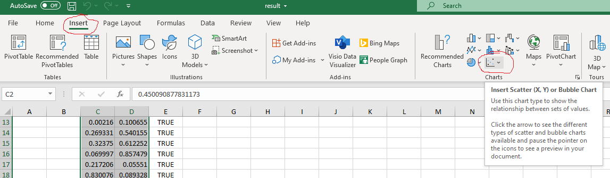
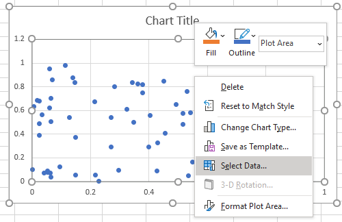

# monteCarlo
Zadanie na laboratoria z monte carlo
Wykonać zadanie proszę w pliku/klasie SolveMe( w oznaczonym miejscu #TODO), w innych klasach nie dokonuj zmian!

Zadanie 1

Napisz algorytm liczący pole koła o promieniu 1 na podstawie metody monte carlo i podaj wartość liczby pi, która wychodzi z oszacowania. Następnie w pliku result.xlsx wygeneruj 
wykres z zaznaczonymi punktami dla wylosowanych punktów (inny kolor dla wartości trafionych [true] i nietrafionych [false], jak to zrobić pokazane na obrazku) dla 
zakładki kolo1 i kolo 2

Podpowiedź: szansa na trafienie dla dużej ilości prób  = pole koła w kwadracie/pole kwadratu = ilość strzałów trafionych/ ilość strzałów całkowitych

Zadanie 2

Napisz algorytm na przeliczenie wartości całki dla xE(0,2) metodą Monte Carlo.
Link do całki: https://www.wolframalpha.com/input/?i=integral+from+0+to+2+%28x%5E2%29
Podpowiedź:

&space;\dfrac{1}{N&space;}&space;\sum_{i=0}^{N-1}&space;f(X_i).)
